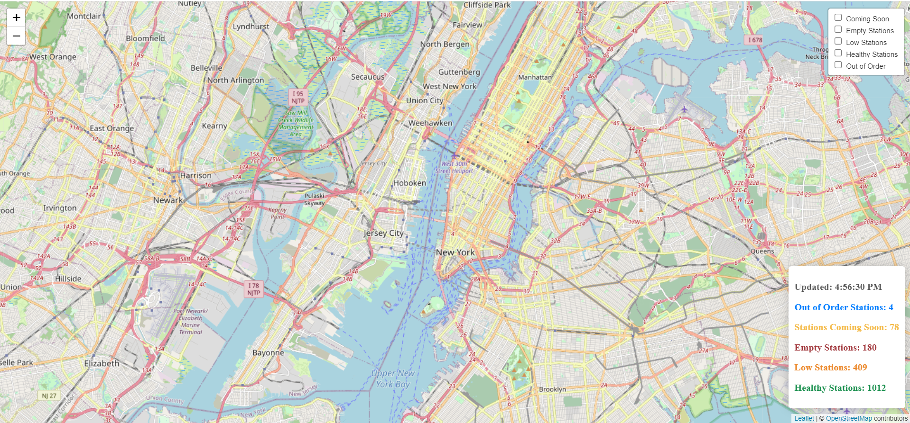

# Leaflet Citibike Map  

**Overview:** ``` Included in this repository are seven different versions of a Leaflet map using the same Citibike api information.  ```  

## Outcomes  

Below are three examples of what the content looks like.  When the page loads there should be no markers added to the map.

    

By selecting the overlay controls in the upper right corner, you can add markers to the map.  
  

Here is a map with all the markers added.  
  

## Repo Contents

*  Two of the folders are labeled deprecated because those maps use an older version of D3js, mapbox.com tiles that require the use of an API Key, and several other small changes relative to the current Leaflet recommencations.  
   *  If you want to run these files, you will need to sign up for a mapbox.com account and add your default api token to `config.js` in the js folder.  
*  Folder 03 is very similar to the existing basic version found in the class repo but with the code written without functions.
*  Folder 04 is a modified version of the Advanced class activity that is more linear (does not use functions) and can be a bit easier to follow.
*  Folder 05, 06 are refactored versions of Folder 04.
*  Folder 07 is my preferred method of writing it since it does a couple things:  
   *  It merges the 2 API datasources without assuming that each list is ordered by id's identically.  My code can have the objects in random order and it will still merge the content.  
   *  I have structured the code to be largely broken into sections like 1) Map Setup (no data needed), 2) Legend Setup (data needed), 3) Creating and Adding Markers (data needed).  
   *  Each section and function typically only serves one purpose
   *  I have two functions which act only as lookup/conversion functions.  I almost always pull this type of functionality out into its own function at the top or bottom of my code.  


## Packages

d3.js - Leaflet dependency and loads data  
Leaflet.js  - Map Generation  
Leaflet.css  - Map Generation  
Leaflet.extra-markers.js  - add custom markers  
moment.js - time formatter (used only for the legend)


## Data Source  
The data comes from the citibike api.  
*  https://gbfs.citibikenyc.com/gbfs/en/station_information.json  
*  https://gbfs.citibikenyc.com/gbfs/en/station_status.json  

Below are sample outputs of each api endpoint.  As you can see the api results are station lists that are in the same order and have a common key between them:  `legacy_id`.   Folders 01 - 06 combine these two lists in the javascript assuming the order is the same.  Folder 07 assumes the lists have a random order and need to be matched on the `legacy_id`.  

  


  


## Setup and Running  
1.  Clone the repo to you local machine.  
1.  Open the folder in VSCode (or your IDE of choice).
1.  You can use the python httpserver to deploy the `index.html` through a terminal program.  I prefer to use the VSCode Extention called `LiveServer`.  Once installed you can right click on the `index.html` file and select `View with LiveServer`.


## References
[Extra Markers](https://github.com/coryasilva/Leaflet.ExtraMarkers)